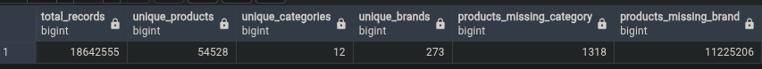
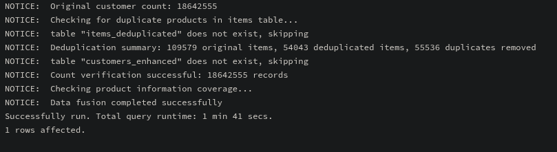

# Piscine Data Science Project - Data Warehouse

## Overview

This project implements data warehousing functionalities for an e-commerce database as specified in the Piscine Data Science 1 exercises. The implementation focuses on consolidating customer data from multiple tables and implementing sophisticated deduplication logic to ensure data quality and integrity.

## Project Structure

```
project/
├── ex00/
│   └── (Database visualization tools setup)
├── ex01/
│   └── customers_table.py
│   └── customers_table.sql
├── ex02/
│   └── remove_duplicates.py
│   └── remove_duplicates.sql
├── data/
│   ├── customer/
│   │   ├── data_2022_dec.csv
│   │   ├── data_2022_nov.csv
│   │   ├── data_2022_oct.csv
│   │   └── data_2023_jan.csv
│   └── items/
│       └── items.csv
└── README.md
```

## Exercise 01: Customers Table Creation

### Objective

Create a unified `customers` table by joining data from all monthly customer data tables (`data_2022_oct`, `data_2022_nov`, `data_2022_dec`, `data_2023_jan`).

### Implementation

The solution employs PostgreSQL's UNION ALL operation to efficiently combine all records from the four monthly tables into a single comprehensive table, while maintaining data provenance through a source_table column.

#### SQL Implementation (`customers_table.sql`)

```sql
-- Create the customers table with the same structure
CREATE TABLE IF NOT EXISTS customers (
    event_time TIMESTAMP,
    event_type VARCHAR(255),
    product_id INTEGER,
    price NUMERIC(10, 2),
    user_id BIGINT,
    user_session VARCHAR(255),
    source_table VARCHAR(50)
);

-- Populate with UNION ALL from all source tables
INSERT INTO customers (event_time, event_type, product_id, price, user_id, user_session, source_table)
SELECT 
    event_time, event_type, product_id, price, user_id, user_session, 'data_2022_oct' AS source_table
FROM data_2022_oct
UNION ALL
SELECT 
    event_time, event_type, product_id, price, user_id, user_session, 'data_2022_nov' AS source_table
FROM data_2022_nov
UNION ALL
SELECT 
    event_time, event_type, product_id, price, user_id, user_session, 'data_2022_dec' AS source_table
FROM data_2022_dec
UNION ALL
SELECT 
    event_time, event_type, product_id, price, user_id, user_session, 'data_2023_jan' AS source_table
FROM data_2023_jan;

-- Create indexes for performance optimization
CREATE INDEX idx_customers_event_time ON customers(event_time);
CREATE INDEX idx_customers_product_id ON customers(product_id);
CREATE INDEX idx_customers_user_id ON customers(user_id);
```

#### Python Implementation (`customers_table.py`)

A Python script that executes the SQL operations with additional features:
- Progress monitoring during the data transfer process
- Verification of record counts between source and destination tables
- Performance metrics reporting

#### SQL Index Creation Explanation
This SQL statement creates an index named `idx_customers_event_time` on the `event_time` column of the `customers` table. 

Indexes are database structures that improve the speed of data retrieval operations. When you create an index on a column, the database engine builds a separate data structure (typically a B-tree) that allows it to quickly locate rows with specific values in that column without having to scan the entire table.

In this case, the index is specifically targeting the `event_time` column, suggesting that this table will frequently be queried based on time-related criteria. For example, queries that filter customers by date ranges or sort by timestamp would benefit from this index.

The comment above the statement explains the purpose of this index - to improve query performance. Without this index, queries that filter or sort by `event_time` would require a full table scan, which becomes increasingly inefficient as the table grows in size.

However, it's worth noting that while indexes speed up read operations, they can slightly slow down write operations (INSERT, UPDATE, DELETE) because the index must be updated along with the table. Therefore, indexes should be created judiciously, focusing on columns frequently used in WHERE clauses, JOIN conditions, or ORDER BY statements.

### Key Features

- **Data Provenance**: Tracks the source table for each record
- **Performance Optimization**: Creates indexes on commonly queried columns
- **Verification**: Confirms that all records are successfully transferred
- **Scalability**: Designed to handle millions of records efficiently

## Exercise 02: Remove Duplicates

### Objective

Remove duplicate records from the `customers` table, with special handling for sequential events that occur within a 1-second interval, as specified in the project requirements.

### Implementation

The solution uses SQL window functions to identify and remove two types of duplicates:
1. Exact duplicates - records where all fields match exactly
2. Time-proximity duplicates - same actions by the same user on the same product within 1 second

#### SQL Implementation (`remove_duplicates.sql`)

```sql
-- Create a temporary table to identify records to keep
CREATE TEMPORARY TABLE customers_to_keep AS
WITH ranked_records AS (
    SELECT 
        event_time, event_type, product_id, price, user_id, user_session, source_table,
        -- Identify exact duplicates
        ROW_NUMBER() OVER (
            PARTITION BY event_time, event_type, product_id, price, user_id, user_session, source_table
            ORDER BY event_time
        ) AS exact_duplicate_rank,
        -- Calculate time difference to next similar action
        LEAD(event_time) OVER (
            PARTITION BY event_type, product_id, user_id
            ORDER BY event_time
        ) - event_time AS time_diff_to_next
    FROM customers
)
SELECT 
    event_time, event_type, product_id, price, user_id, user_session, source_table
FROM ranked_records
WHERE 
    exact_duplicate_rank = 1
    AND (time_diff_to_next IS NULL OR EXTRACT(EPOCH FROM time_diff_to_next) > 1);

-- Replace the original table with deduplicated data
CREATE TABLE customers_deduplicated AS SELECT * FROM customers_to_keep;
DROP TABLE customers;
ALTER TABLE customers_deduplicated RENAME TO customers;
```

#### Python Implementation (`remove_duplicates.py`)

A Python script that:
- Executes the deduplication SQL with progress reporting
- Provides detailed statistics on the number of duplicates removed
- Reports performance metrics for the operation

### Key Features

- **Advanced Deduplication Logic**: Handles both exact duplicates and time-proximity duplicates
- **Efficient Processing**: Uses SQL window functions for performance
- **Comprehensive Reporting**: Shows detailed statistics about removed records
- **Data Integrity**: Maintains all necessary indexes and table structure

## Usage Instructions

### Exercise 01: Creating the Unified Customers Table

**Using the SQL Script:**
```bash
psql -U your_login -d piscineds -f ex01/customers_table.sql
```


### Exercise 02: Removing Duplicates

This exercise focuses on the removal of duplicate records from the database.

The SQL script (`ex02/remove_duplicates.sql`) identifies and eliminates duplicate entries based on temporal proximity. It leverages the LEAD() window function to detect when the same user performs identical actions on the same product within a short time interval.

The technique works by:
1. Partitioning data by event_type, product_id, and user_id
2. Calculating the time difference between consecutive events in each partition
3. Flagging events that occur too close together as potential duplicates
4. Removing these duplicate records while preserving the original user interaction pattern

This cleaning process is essential for maintaining data integrity and ensuring accurate analytics, as duplicate records can significantly skew metrics like engagement rates, conversion counts, and user behavior analysis.


# SQL Window Function with LEAD

The selected code is using a SQL window function called `LEAD()` to calculate the time difference between consecutive events. Let's break it down:

```sql
LEAD(event_time) OVER (
    PARTITION BY event_type, product_id, user_id
    ORDER BY event_time
) - event_time AS time_diff_to_next
```

## Components:

1. **LEAD Function**: 
   - `LEAD(event_time)` looks ahead to the next row's `event_time` value
   - It returns NULL if there is no next row

2. **OVER Clause**:
   - Defines the window of rows the function operates on

3. **PARTITION BY**:
   - Divides rows into groups based on `event_type`, `product_id`, and `user_id`
   - The window function is applied separately within each group

4. **ORDER BY**:
   - Sorts rows within each partition by `event_time`
   - Determines the order for finding the "next" row

5. **Calculation**:
   - `LEAD(event_time) - event_time`: Subtracts the current row's timestamp from the next row's timestamp
   - Returns the time difference between consecutive events
   - Named as `time_diff_to_next`

This calculation is useful for finding duplicate or closely timed events, analyzing user behavior sequences, or implementing time-based business rules.

To execute this data cleaning operation, run the provided SQL script against your database using the psql command shown above.

Using the SQL Script:**
```bash
psql -U your_login -d piscineds -f ex02/remove_duplicates.sql
```


#### Performance Considerations

- The UNION ALL operation is significantly faster than multiple separate queries
- Window functions are used for efficient duplicate identification
- Temporary tables minimize storage overhead during processing
- Indexes are strategically created to optimize subsequent queries

## Exercise 03: fusion of the two tables



